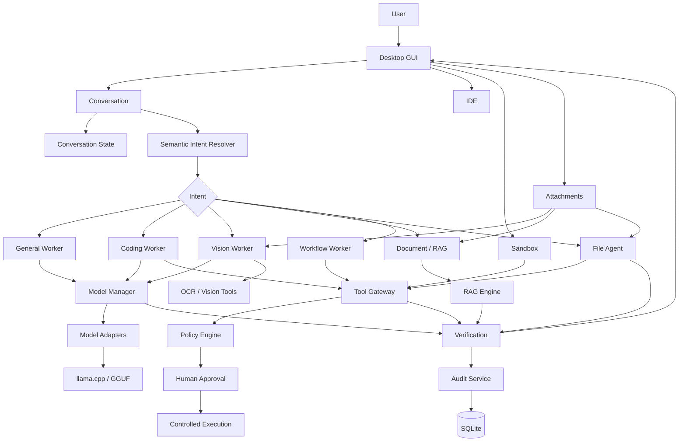
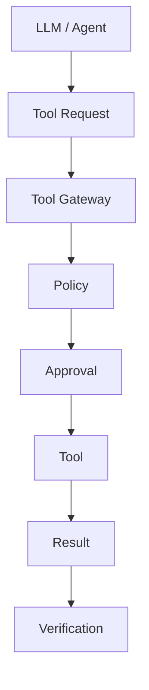

# Local Agentic AI Workbench

> A local-first agentic AI desktop workbench for students, developers, and engineering workflows. The project combines local language models, multimodal vision, semantic routing, file agents, IDE tooling, sandboxed execution, RAG, verification, policy controls, RBAC, audit logging, and local data services.


---

## Table of Contents

1. [Overview](#1-overview)
2. [What Makes It Agentic](#2-what-makes-it-agentic)
3. [Learning Objectives](#3-learning-objectives)
4. [Architecture at a Glance](#4-architecture-at-a-glance)
5. [Detailed Request Lifecycle](#5-detailed-request-lifecycle)
6. [Core Components](#6-core-components)
7. [Model Manager](#7-model-manager)
8. [Semantic Intent Routing](#8-semantic-intent-routing)
9. [Conversation Context](#9-conversation-context)
10. [Multimodal Vision](#10-multimodal-vision)
11. [File Agent](#11-file-agent)
12. [IDE](#12-ide)
13. [Sandbox](#13-sandbox)
14. [RAG](#14-rag)
15. [Tools and Gateway](#15-tools-and-gateway)
16. [Verification](#16-verification)
17. [Security and Policy](#17-security-and-policy)
18. [Authentication and RBAC](#18-authentication-and-rbac)
19. [Audit Logging](#19-audit-logging)
20. [Database Layer](#20-database-layer)
21. [Repository Structure](#21-repository-structure)
22. [Included Models](#22-included-models)
23. [Windows RTX 5060 Packaging](#23-windows-rtx-5060-packaging)
24. [Installation](#24-installation)
25. [Running](#25-running)
26. [Testing](#26-testing)
27. [Example Workflows](#27-example-workflows)
28. [How to Debug](#28-how-to-debug)
29. [How to Extend](#29-how-to-extend)
30. [Student Projects](#30-student-projects)
31. [Design Principles](#31-design-principles)
32. [Known Deployment Notes](#32-known-deployment-notes)
33. [Roadmap](#33-roadmap)
34. [Final Mental Model](#34-final-mental-model)

---

# 1. Overview

Local Agentic AI Workbench is a desktop application that demonstrates how a modern AI assistant can go beyond text generation.

A traditional chatbot is approximately:

```text
User
  |
  v
Prompt
  |
  v
LLM
  |
  v
Text
```

This project expands that into:

```text
User
  |
  v
Context + Intent + Attachments
  |
  v
Agent Router
  |
  +-------------------+-------------------+
  |                   |                   |
  v                   v                   v
General            Coding             Vision
  |                   |                   |
  v                   v                   v
Local LLM        File / IDE          Qwen-VL
                    Tools
  |                   |                   |
  +-------------------+-------------------+
                      |
                      v
                 Verification
                      |
                      v
                   Audit
                      |
                      v
                    GUI
```

The purpose is educational as much as functional.

Students can use this repository to study:

- local LLM inference,
- multimodal AI,
- semantic intent detection,
- agent/tool architectures,
- RAG,
- software architecture,
- security,
- verification,
- desktop GUI engineering,
- model routing,
- subprocess execution,
- and deployment.

---

# 2. What Makes It Agentic

An application becomes more agentic when it does more than answer the immediate text prompt.

For example:

```text
"make a python file"
```

should not merely return:

```python
print("Hello")
```

It should be able to:

```text
Understand request
      |
      v
Decide CREATE_FILE
      |
      v
Generate content
      |
      v
Choose filename/path
      |
      v
Write file
      |
      v
Verify file
      |
      v
Report actual artifact
```

Similarly:

```text
[image attached]
"what is this?"
```

requires:

```text
Image
  +
Question
  +
Conversation context
       |
       v
Vision intent
       |
       v
Vision model
       |
       v
Image understanding
       |
       v
Verified response
```

That combination of understanding, action, and verification is the core agentic concept.

---

# 3. Learning Objectives

## Artificial Intelligence

Students can study:

- instruction-tuned models,
- quantized GGUF models,
- multimodal inference,
- model selection,
- prompt construction,
- context windows,
- RAG,
- OCR,
- response verification.

## Software Engineering

Students can study:

- modular design,
- separation of concerns,
- adapters,
- contracts,
- state machines,
- service layers,
- error handling,
- regression testing,
- packaging.

## Systems Engineering

Students can study:

- process management,
- local model serving,
- filesystem access,
- subprocess execution,
- runtime discovery,
- resource management.

## Security

Students can study:

- policy enforcement,
- RBAC,
- sanitization,
- prompt injection,
- human approval,
- destructive-operation controls.

---

# 4. Architecture at a Glance



The project archive contains dedicated backend modules for audit, authentication, database, organizer, policy, RBAC, security, verification, and workflows. It also contains GUI modules, model-manager modules, RAG modules, tools, runtime sandbox code, and tests. fileciteturn33file0L75-L116 fileciteturn33file0L167-L240

---

# 5. Detailed Request Lifecycle

The best way to understand the application is to follow one request.

## Stage 1 — User input

```text
"make a python file"
```

or:

```text
[apple.jpg]
"what is this?"
```

## Stage 2 — Context collection

The system considers:

- current message,
- previous messages,
- attached file,
- active workspace,
- current file,
- current intent,
- possibly previous tool results.

## Stage 3 — Intent resolution

Examples:

```text
"what is PSU"
            -> GENERAL

"generate python code"
            -> CODING

"make python file"
            -> CREATE_FILE

"identify" + image
            -> VISION

"read this" + PDF
            -> DOCUMENT
```

## Stage 4 — Worker selection

```text
GENERAL  -> General model
CODING   -> Coding model
VISION   -> Vision model
FILE     -> File Agent
RAG      -> Retrieval pipeline
```

## Stage 5 — Model/tool execution

The selected worker performs its operation.

## Stage 6 — Verification

The result is checked.

For example:

```text
Model:
"file created"

Verifier:
Does file exist?
Is file non-empty?
Is format valid?

Result:
PASS
```

## Stage 7 — Audit

The operation can be recorded.

## Stage 8 — GUI response

The user receives:

- response,
- worker,
- status,
- artifact path,
- verification result where appropriate.

---

# 6. Core Components

The project is organized around several major layers.

```text
desktop_gui/
        |
        v
Application/UI layer
        |
        v
semantic_organizer / intent_resolver
        |
        v
Model Manager / Tool Gateway
        |
        +--------+---------+
        |        |         |
        v        v         v
      Models    Tools     RAG
        |        |         |
        +--------+---------+
                 |
                 v
            Verification
                 |
                 v
               Audit
```

The repository contains dedicated files for conversation state, chat service, semantic organizing, intent resolution, file operations, IDE support, sandbox support, and PC access. fileciteturn33file0L194-L240

---

# 7. Model Manager

The Model Manager is an abstraction layer between application logic and model implementations.

Without a model manager:

```text
GUI
 |
 +--> llama.cpp
 +--> model A
 +--> model B
 +--> vision model
```

This quickly becomes difficult to maintain.

With a manager:

```text
GUI
 |
 v
Model Manager
 |
 +--> Coding Adapter
 +--> General Adapter
 +--> Vision Adapter
 +--> Test Adapter
```

## Why adapters?

Different model backends have different APIs.

An adapter provides a consistent internal interface:

```text
Application
   |
   v
Common interface
   |
   +--> Llama.cpp
   +--> Transformer backend
   +--> Mock backend
```

This is the Adapter Pattern.

## Response contract

A robust system should have one normalized internal response type, conceptually:

```python
@dataclass
class WorkerResponse:
    worker_type: str
    status: str
    content: str
    tokens_generated: int
    error_message: str = ""
```

This prevents downstream code from having to guess whether a model returned:

```python
dict
```

or:

```python
object.status
```

or:

```python
string
```

---

# 8. Semantic Intent Routing

Intent routing is one of the most important parts of the project.

## Why keywords are not enough

Consider:

```text
generate python code
```

versus:

```text
generate python file
```

They are related but not identical.

The first asks for code.

The second asks for an artifact.

Therefore:

```text
generate python code
      |
      v
CODING

generate python file
      |
      v
CREATE_FILE
```

## Context changes intent

Compare:

```text
"what is this?"
```

with:

```text
"what is this?" + image
```

The second should route toward Vision.

The same phrase with a PDF should route toward a document pipeline.

The same phrase with an Excel file should route toward spreadsheet analysis.

This demonstrates an important principle:

> Intent is a function of language + context + attachment + state.

Conceptually:

```text
Intent =
    f(
        message,
        attachment,
        conversation,
        workspace,
        current_task
    )
```

---

# 9. Conversation Context

A good assistant must understand references such as:

```text
User:
open this image

User:
what is it?

User:
is it safe?
```

The final question is incomplete without previous context.

A useful state model is:

```text
Conversation
 |
 +--> messages
 +--> title
 +--> current attachment
 +--> current file
 +--> previous intent
 +--> previous tool result
 +--> workspace
```

## Context-aware naming

A useful chat title should be derived from the user's first meaningful message.

Examples:

```text
"make a python file"
        -> Python File Generation

"make three js page"
        -> Three.js Webpage

"analyze database"
        -> Database Analysis
```

The exact implementation can evolve, but the design principle is that chat names should describe the conversation rather than always displaying "New Chat".

---

# 10. Multimodal Vision

Vision is a separate modality from text-only inference.

## Pipeline


The packaged model directory includes:

```text
Qwen2.5-VL-3B-Instruct-GGUF/
├── Qwen2.5-VL-3B-Instruct-Q4_K_M.gguf
└── mmproj-Qwen2.5-VL-3B-Instruct-Q8_0.gguf
```

Both were verified inside the model archive. fileciteturn33file0L326-L330

## Why direct model testing matters

There are two different questions:

```text
Does the VLM work?
```

and:

```text
Does the GUI successfully send the image to the VLM?
```

A direct multimodal diagnostic can pass while the GUI still fails because of:

- attachment state,
- routing,
- path handling,
- widget lifecycle,
- payload construction.

This distinction is extremely useful when debugging AI applications.

---

# 11. File Agent

The File Agent turns natural-language requests into actual filesystem operations.

## Example

```text
User:
make a python file
```

Correct flow:

```text
Request
  |
  v
Intent = CREATE_FILE
  |
  v
Generate content
  |
  v
Choose target filename
  |
  v
Write
  |
  v
Verify
  |
  v
Return path
```

## Artifact verification

A file-generation system should not report success just because the model produced a code block.

For example:

```text
Model:
"Created generated_script.py"

Verifier:
Path exists?      YES
Regular file?     YES
Size > 0?         YES
Syntax valid?     YES

Final:
PASS
```

This is stronger than raw text generation.

---

# 12. IDE

The project contains an agentic IDE implementation and an IDE Agent Bridge. fileciteturn33file0L194-L216

Conceptually:

```text
+------------------------------------------------------+
| Explorer              | Editor                       |
|                       |                              |
| main.py               | def hello():                 |
| app.py                |     print("Hello")          |
| index.html            |                              |
| styles.css            |                              |
|                       |                              |
+-----------------------+------------------------------+
| Terminal | Output | Problems | Agent | Sandbox       |
+------------------------------------------------------+
```

## IDE capabilities

A mature IDE layer can provide:

- project tree,
- editor,
- file opening,
- save,
- search,
- run,
- output,
- agent assistance,
- sandbox integration.

The key architectural idea is that IDE operations should reuse the same file, model, and tool infrastructure instead of becoming an isolated second application.

---

# 13. Sandbox

The Sandbox provides controlled code execution.

Relevant project files include:

```text
tools/sandbox/sandbox_runner.py
tools/sandbox/languages.py
runtime/sandbox/main.py
```

These are present in the verified archive. fileciteturn33file0L113-L116 fileciteturn33file0L297-L299

## Conceptual pipeline

```text
Code
 |
 v
Language selection
 |
 v
Sandbox runner
 |
 v
Controlled process
 |
 +--> stdout
 +--> stderr
 +--> exit code
 |
 v
Verification
 |
 v
GUI
```

The purpose is to separate code generation from arbitrary direct execution.

---

# 14. RAG

Retrieval-Augmented Generation combines search with generation.

Instead of:

```text
Question -> LLM -> Answer
```

use:

```text
Question
   |
   v
Retriever
   |
   v
Evidence
   |
   v
LLM + Evidence
   |
   v
Grounded Answer
```

The repository contains:

```text
rag/
├── engine.py
└── store.py
```

and the archive also includes RAG document/index data. fileciteturn33file0L243-L245 fileciteturn33file0L260-L267

## Grounding verification

The project tests cases such as:

```text
No evidence
    -> FAIL

Minimal overlap / ungrounded answer
    -> NEEDS_HUMAN_REVIEW

Strong evidence overlap
    -> PASS
```

This is a useful example of why retrieval and verification should be separate concerns.

---

# 15. Tools and Gateway

The repository includes a tool gateway and several specialized tools:

```text
tools/
├── gateway.py
├── registry.py
├── sandbox/
├── spreadsheets/
├── ocr/
├── vision/
├── documents/
└── file_tools/
```

These components are present in the project archive. fileciteturn33file0L296-L310

## Tool architecture



The gateway creates a security boundary between model-generated intent and actual system operations.

---

# 16. Verification

Verification is a separate stage because generation can be wrong.

## The important distinction

```text
Generation:
"What does the model say?"

Verification:
"Did the requested thing actually happen?"
```

### File

```text
exists?
valid?
non-empty?
```

### Vision

```text
response exists?
expected content?
no unsupported claims?
```

### RAG

```text
evidence present?
answer grounded?
```

### Tool

```text
allowed?
executed?
successful?
```

The repository has a dedicated verification engine and dedicated verification tests. fileciteturn33file0L81-L84

---

# 17. Security and Policy

An AI system with tools can create real-world side effects even when everything runs locally.

Potential risks include:

- destructive commands,
- filesystem deletion,
- unsafe code,
- malicious files,
- prompt injection,
- unauthorized operations.

The security architecture should therefore be:

```text
Request
  |
  v
Sanitize
  |
  v
Intent
  |
  v
Policy
  |
  +---- blocked ----> Reject
  |
  +---- approval ---> Human Approval
  |
  v
Tool
  |
  v
Verification
  |
  v
Audit
```

The project includes policy, security, human-approval, prompt-injection, and tool-gateway tests. fileciteturn33file0L81-L99 fileciteturn33file0L246-L255

---

# 18. Authentication and RBAC

The backend contains authentication and RBAC components.

Conceptually:

```text
User
 |
 v
Authentication
 |
 v
Identity
 |
 v
Role
 |
 v
Permissions
 |
 v
Action
```

Example:

```text
Student
 -> run code
 -> read files
 -> create artifacts

Admin
 -> student permissions
 -> policy administration
 -> audit access
```

The actual permission matrix should be determined by the implementation and project requirements.

---

# 19. Audit Logging

A useful agent platform needs traceability.

A conceptual audit event:

```json
{
  "request_id": "abc123",
  "intent": "CREATE_FILE",
  "worker": "coding",
  "operation": "write",
  "target": "generated.py",
  "verification": "PASS"
}
```

The project contains an audit service and E2E audit-integrity coverage. fileciteturn33file0L92-L93 fileciteturn33file0L249-L255

Audit logs are useful for:

- debugging,
- accountability,
- security review,
- reproducibility,
- teaching.

---

# 20. Database Layer

The project includes SQLite-backed data.

The verified package contains:

```text
data/demo_db/industrial_demo.db
data/workbench.db
data/chat_history.db
```

as well as artifacts and document data. fileciteturn33file0L260-L279

## Database workflow

```text
Database
   |
   v
Inspect schema
   |
   +--> tables
   +--> columns
   +--> indexes
   |
   v
Read / Analyze
   |
   v
Verify
```

Read-only analysis and destructive operations should be treated differently.

---

# 21. Repository Structure

A simplified repository map:

```text
Locall-Agentic-AI-Workbench/
│
├── backend/
│   └── app/
│       ├── audit/
│       ├── auth/
│       ├── core/
│       ├── database/
│       ├── organizer/
│       ├── policy/
│       ├── rbac/
│       ├── security/
│       ├── verification/
│       └── workflows/
│
├── core/
│   └── contracts.py
│
├── desktop_gui/
│   ├── main.py
│   ├── chat_service.py
│   ├── conversation_state.py
│   ├── semantic_organizer.py
│   ├── intent_resolver.py
│   ├── file_agent.py
│   ├── file_edit_agent.py
│   ├── ide_agent_bridge.py
│   ├── agentic_ide.py
│   ├── sandbox_service.py
│   ├── pc_access.py
│   ├── safe_tools.py
│   └── styles.py
│
├── model_manager/
│   ├── manager.py
│   ├── registry.py
│   └── adapters/
│
├── rag/
│   ├── engine.py
│   └── store.py
│
├── tools/
│   ├── gateway.py
│   ├── registry.py
│   ├── sandbox/
│   ├── spreadsheets/
│   ├── ocr/
│   ├── vision/
│   ├── documents/
│   └── file_tools/
│
├── runtime/
│   └── sandbox/
│
├── tests/
│
├── data/
│
├── configs/
├── models/
├── scripts/
│
├── package.json
├── requirements.txt
├── requirements-windows.txt
├── run_tests.py
├── run_workbench.sh
├── setup_windows.bat
├── install_and_start.bat
├── start_workbench.bat
└── check_gpu.bat
```

The actual archive was checked and these major directories/files are present. fileciteturn33file0L75-L116 fileciteturn33file0L167-L240

---

# 22. Included Models

The verified model archive contains five GGUF artifacts. fileciteturn33file0L343-L349

## StarCoder2 3B

```text
models/starcoder2-3b/
└── starcoder2-3b-instruct.Q4_K_M.gguf
```

Likely role:

- coding,
- programming assistance.

## Qwen2.5 3B

```text
models/qwen2.5-3b/
└── qwen2.5-3b-instruct-q4_k_m.gguf
```

Likely role:

- general local language tasks.

## Qwen2.5-VL 3B

```text
models/Qwen2.5-VL-3B-Instruct-GGUF/
├── Qwen2.5-VL-3B-Instruct-Q4_K_M.gguf
└── mmproj-Qwen2.5-VL-3B-Instruct-Q8_0.gguf
```

Likely role:

- multimodal vision.

## Gemma 3 4B

```text
models/gemma3-4b/
└── google_gemma-3-4b-it-Q4_K_M.gguf
```

Likely role:

- general instruction following.

---

# 23. Windows RTX 5060 Packaging

Two archives were prepared:

```text
Locall-Agentic-AI-Workbench-Windows-5060.zip
Locall-Agentic-AI-Workbench-Models.zip
```

The verification report shows:

- project archive: about 1.6 MB,
- model archive: about 8.4 GB,
- both passed `unzip -t`. fileciteturn33file0L45-L48 fileciteturn33file0L315-L330

The project ZIP contains:

```text
install_and_start.bat
setup_windows.bat
start_workbench.bat
check_gpu.bat
requirements-windows.txt
```

fileciteturn33file0L334-L340

The model archive contains five GGUF files and no cache/lock/metadata files. fileciteturn33file0L343-L354

## Important Windows concept

Do not copy a Linux virtual environment to Windows.

Likewise:

```text
Linux executable
    !=
Windows executable
```

GGUF model files are portable data files, but the inference executable and OS/runtime dependencies must match Windows.

---

# 24. Installation

## Linux

Typical development setup:

```bash
cd ~/Locall-Agentic-AI-Workbench

python3 -m venv .venv
source .venv/bin/activate

pip install -r requirements.txt

./run_workbench.sh
```

## Windows

The intended first-run sequence is:

```text
Extract project ZIP
       |
       v
Extract model ZIP into project
       |
       v
install_and_start.bat
```

The current Windows setup script:

1. checks for Python 3.12,
2. creates `.venv`,
3. upgrades pip/setuptools/wheel,
4. installs `requirements-windows.txt`,
5. checks PySide6,
6. creates model, vision-media, log, and workspace directories. fileciteturn33file0L380-L457

---

# 25. Running

## Linux

```bash
./run_workbench.sh
```

## Windows

```text
start_workbench.bat
```

For first-time setup:

```text
install_and_start.bat
```

The Windows launcher uses the local virtual environment's Python executable. fileciteturn33file0L462-L502

---

# 26. Testing

The project contains unit and E2E tests:

```text
tests/
├── test_auth.py
├── test_e2e_workflows.py
├── test_human_approval.py
├── test_model_manager.py
├── test_prompt_injection.py
├── test_rag_security.py
├── test_rbac_policy.py
├── test_tool_gateway.py
└── test_verification_engine.py
```

The archive confirms these modules are included. fileciteturn33file0L246-L255

## Full suite

```bash
python3 run_tests.py
```

## Compile checks

```bash
python3 -m compileall -q     core     desktop_gui     model_manager     tools
```

## Functional tests

A good AI application tests more than imports.

Test:

```text
Input
  |
  v
Intent
  |
  v
Worker
  |
  v
Model
  |
  v
Tool
  |
  v
Artifact
  |
  v
Verification
```

---

# 27. Example Workflows

## General

```text
User:
what is PSU?
```

Expected:

```text
GENERAL
```

## Coding

```text
User:
generate python code to reverse a string
```

Expected:

```text
CODING
```

## File generation

```text
User:
make a python file
```

Expected:

```text
CREATE_FILE
```

followed by a verified `.py` artifact.

## Vision

```text
User:
[attach apple.jpg]

User:
what is this?
```

Expected:

```text
VISION
```

followed by a visual answer.

## Context

```text
User:
attach image

User:
what is it?

User:
what color is it?
```

The final request depends on the attachment and previous context.

## RAG

```text
User:
What does the attached inspection report say about corrosion?
```

Expected high-level pipeline:

```text
Document
  |
  v
Ingestion
  |
  v
Retrieval
  |
  v
Evidence
  |
  v
LLM
  |
  v
Grounding verification
```

---

# 28. How to Debug

Debug from the bottom of the stack upward.

## Step 1 — File

```text
Does the file exist?
Is the path correct?
```

## Step 2 — GUI

```text
Did the selected file appear?
Did attachment state change?
```

## Step 3 — Intent

```text
Which intent was selected?
```

## Step 4 — Worker

```text
Which worker executed?
```

## Step 5 — Model

```text
Did the worker load the correct model?
```

## Step 6 — Inference

```text
Did it return content?
```

## Step 7 — Tool

```text
Did the tool actually execute?
```

## Step 8 — Verification

```text
Did the output satisfy the requirement?
```

## Step 9 — Audit

```text
Was the event recorded?
```

This method is much faster than randomly changing UI code.

---

# 29. How to Extend

## Add a model

1. Place the model under `models/`.
2. Register it.
3. Add or reuse an adapter.
4. Define capabilities.
5. Add routing.
6. Add tests.
7. Test loading.
8. Test actual inference.

## Add a tool

Follow:

```text
Tool
 |
 v
Registry
 |
 v
Gateway
 |
 v
Policy
 |
 v
Approval (if required)
 |
 v
Execution
 |
 v
Verification
```

## Add a language to the Sandbox

Define:

```text
display name
extension
runtime
command
arguments
timeout
```

Example concept:

```json
{
  "name": "Python",
  "extension": ".py",
  "command": "python",
  "mode": "interpreted"
}
```

## Add a new intent

A new intent should have:

```text
name
description
routing rule
worker
tests
failure behavior
```

---

# 30. Student Projects

This repository can be used as a semester/project-learning platform.

## Beginner

### Task 1 — Trace a Request

Follow:

```text
"what is PSU?"
```

from GUI input to final response.

### Task 2 — Explain Routing

Why are these different?

```text
generate python code

make python file
```

### Task 3 — Model Adapter

Read the adapter code and document the interface.

---

## Intermediate

### Task 4 — New File Type

Add natural-language support for:

```text
make a markdown file
```

### Task 5 — New Sandbox Language

Add another supported language.

### Task 6 — Chat Titles

Implement context-aware automatic chat naming.

---

## Advanced

### Task 7 — Confidence Routing

Return:

```text
VISION  : 0.97
CODING  : 0.90
GENERAL : 0.31
```

### Task 8 — Multi-Image Vision

Allow:

```text
image A
image B

"compare these"
```

### Task 9 — Agent Planning

Convert:

```text
"analyze this report and prepare an Excel summary"
```

into:

```text
read
 ->
extract
 ->
analyze
 ->
create spreadsheet
 ->
verify
```

### Task 10 — Full E2E Agent Test

Build a test for:

```text
User
 ↓
Intent
 ↓
Model
 ↓
Tool
 ↓
Artifact
 ↓
Verification
 ↓
Audit
```

---

# 31. Design Principles

## Principle 1 — Intent is semantic

Do not rely purely on keyword matching.

## Principle 2 — Context matters

The same sentence can mean different things with different attachments.

## Principle 3 — Model ≠ application

A working model does not guarantee a working UI.

## Principle 4 — Tool calls require boundaries

Model output should not automatically become a privileged system command.

## Principle 5 — Verify artifacts

Do not trust "done" until the result has been checked.

## Principle 6 — Use stable contracts

Adapters and workers should return predictable structures.

## Principle 7 — Keep the GUI thin

The GUI should orchestrate user interaction, not contain every business rule.

## Principle 8 — Tests are executable documentation

A passing test tells future developers what the project promises.

---

# 32. Known Deployment Notes

The current verified `requirements-windows.txt` contains:

```text
PySide6==6.11.2
PySide6_Addons==6.11.2
PySide6_Essentials==6.11.2
```

fileciteturn33file0L542-L545

Therefore, treat the current Windows dependency file as the currently verified GUI dependency set, not as proof that every model-backend dependency and native inference binary is bundled.

Before a production Windows release, verify:

```text
Python version
Python packages
NVIDIA driver
CUDA compatibility
Windows llama.cpp executable
model paths
vision mmproj path
server configuration
ports
filesystem permissions
```

The current project archive contains Linux-oriented shell scripts as well as Windows batch launchers. fileciteturn33file0L66-L74 fileciteturn33file0L240-L242

---

# 33. Roadmap

## Phase 1 — Stability

- consolidate routing,
- consolidate attachment state,
- formalize worker contracts,
- improve regression tests,
- remove duplicated GUI logic.

## Phase 2 — Agent Intelligence

- improved semantic routing,
- context-aware planning,
- multi-step tool workflows,
- confidence-based routing.

## Phase 3 — Developer Experience

- richer IDE,
- debugger integration,
- code navigation,
- integrated terminal,
- problems panel,
- inline agent assistance.

## Phase 4 — Multimodal

- multi-image reasoning,
- image comparison,
- OCR + vision,
- visual PDF analysis,
- diagram analysis.

## Phase 5 — Deployment

- Windows installer,
- native inference binaries,
- automated model setup,
- hardware detection,
- offline deployment bundle.

---

# 34. Final Mental Model

Remember the Workbench as:

```text
                     LOCAL AGENTIC AI
                           |
          +----------------+----------------+
          |                |                |
          v                v                v
      UNDERSTAND         ACT             VERIFY
          |                |                |
          v                v                v
       Intent           Tools            Evidence
       Context          IDE              Artifacts
       State            Sandbox          Audit
       Files            Files            Results
          |                |                |
          +----------------+----------------+
                           |
                           v
                     MODEL MANAGER
                           |
              +------------+------------+
              |            |            |
              v            v            v
           GENERAL      CODING       VISION
              |            |            |
              v            v            v
           Local LLM   Code Model    Qwen2.5-VL
                                      |
                                      v
                                    mmproj
```

The most important lesson is:

> **An agentic AI system is not just an LLM.**

It is:

```text
LLM
+
Intent
+
Context
+
State
+
Tools
+
Models
+
Security
+
Verification
+
Audit
+
UI
```

That is the engineering problem demonstrated by this project.

---

## Quick Start

### Linux

```bash
cd ~/Locall-Agentic-AI-Workbench
source .venv/bin/activate
./run_workbench.sh
```

### Windows

```text
1. Extract the Workbench ZIP.
2. Extract the Models ZIP into the Workbench folder.
3. Install the required native Windows inference runtime.
4. Run install_and_start.bat.
```

---

## Deployment Verification Snapshot

The project archive was verified with:

```text
No errors detected in compressed data
```

The model archive was also verified with:

```text
No errors detected in compressed data
```

The model archive contains five GGUF artifacts and no cached `.cache`, lock, or metadata files. fileciteturn33file0L315-L354

---

## License

Add the actual repository license before publishing.

Do not claim an MIT, Apache, GPL, or other license unless you have intentionally chosen it.

Also review the licenses of all third-party code, libraries, and models included or referenced by the project.

---

## Acknowledgements

This work combines concepts from:

- local LLM inference,
- quantized GGUF models,
- multimodal vision,
- RAG,
- desktop application engineering,
- sandboxed execution,
- tool gateways,
- security policy,
- verification systems,
- and agentic AI.

Always comply with the license terms of the individual components and models distributed with the project.
