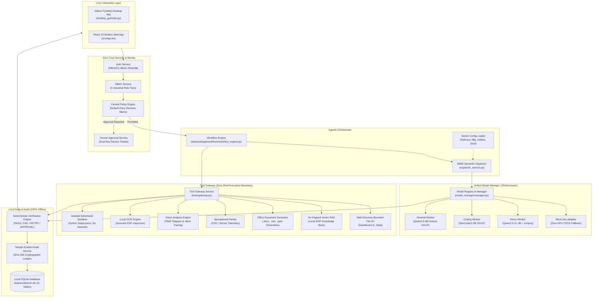
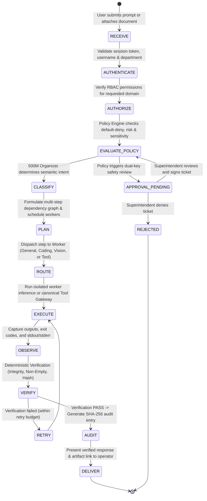
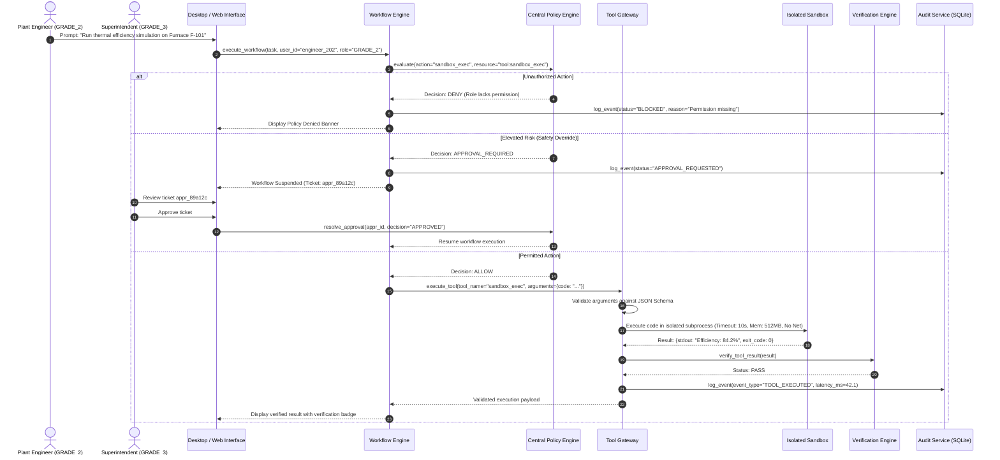
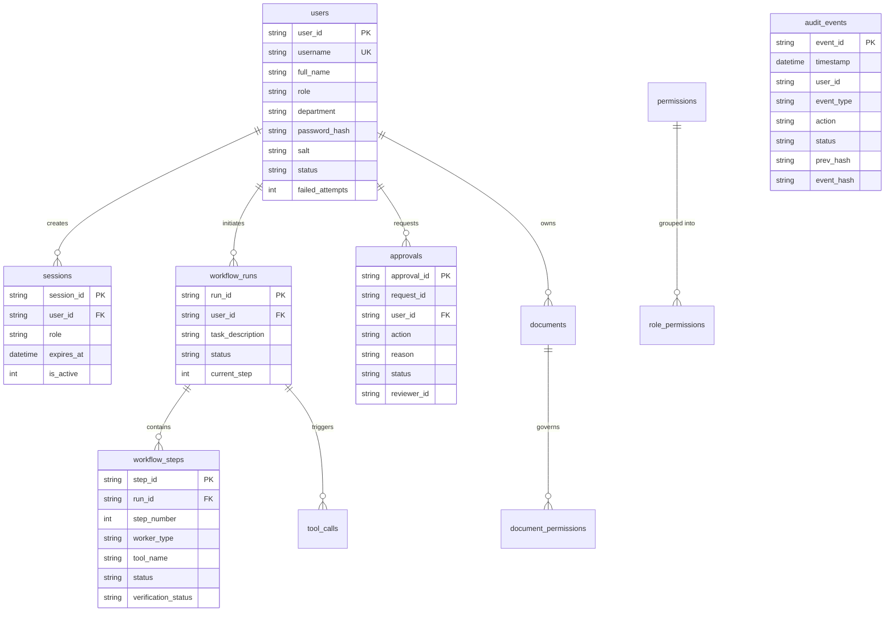

# Sovereign Industrial AI Workbench
### Local-First, Air-Gapped Agentic AI Platform for Mission-Critical Engineering & Industrial Operations

[](.)
[](.)
[](.)
[](.)
[](.)
[](.)
[](.)
[](.)

---

## Master Table of Contents

1. [Executive Overview & Industrial Mission](#1-executive-overview--industrial-mission)
2. [What Makes an AI System "Agentic"?](#2-what-makes-an-ai-system-agentic)
3. [The Core Philosophy: Understand → Plan → Act → Verify](#3-the-core-philosophy-understand--plan--act--verify)
4. [Pedagogical & Learning Objectives](#4-pedagogical--learning-objectives)
   - [Artificial Intelligence & Machine Learning](#artificial-intelligence--machine-learning)
   - [Software Architecture & Systems Engineering](#software-architecture--systems-engineering)
   - [Cyber-Security & Governance](#cyber-security--governance)
   - [Desktop & Modern Web GUI Engineering](#desktop--modern-web-gui-engineering)
5. [System Architecture & Topology](#5-system-architecture--topology)
   - [High-Level Architectural Flowchart](#high-level-architectural-flowchart)
   - [Detailed 10-Stage Request Lifecycle State Machine](#detailed-10-stage-request-lifecycle-state-machine)
   - [Tool Gateway Security Gate & Dual-Key Approval Sequence](#tool-gateway-security-gate--dual-key-approval-sequence)
6. [Core Subsystems & Architectural Deep Dive](#6-core-subsystems--architectural-deep-dive)
   - [Workflow Engine & State Machine Orchestrator](#61-workflow-engine--state-machine-orchestrator)
   - [Semantic Intent Routing & Classification (Why Keywords Fail)](#62-semantic-intent-routing--classification-why-keywords-fail)
   - [Multi-Model Manager, Registry & Unified Adapters](#63-multi-model-manager-registry--unified-adapters)
   - [Multimodal Vision & P&ID Analysis Engine](#64-multimodal-vision--pid-analysis-engine)
   - [Tool Gateway & Zero-Shell Security Boundary](#65-tool-gateway--zero-shell-security-boundary)
   - [Isolated Ephemeral Python Sandbox](#66-isolated-ephemeral-python-sandbox)
   - [Deterministic Verification Engine](#67-deterministic-verification-engine)
   - [Zero-Trust Policy Engine & 4-Tier RBAC](#68-zero-trust-policy-engine--4-tier-rbac)
   - [Human-in-the-Loop (HITL) Dual-Key Approval Gate](#69-human-in-the-loop-hitl-dual-key-approval-gate)
   - [Tamper-Evident SHA-256 Audit Logging](#610-tamper-evident-sha-256-audit-logging)
   - [Air-Gapped Vector Retrieval-Augmented Generation (RAG)](#611-air-gapped-vector-retrieval-augmented-generation-rag)
7. [Multi-Sector Configuration System](#7-multi-sector-configuration-system)
   - [Dynamic Sector Loader Architecture](#dynamic-sector-loader-architecture)
   - [Refinery Sector Profile (MRPL Default)](#refinery-sector-profile-mrpl-default)
   - [Manufacturing Sector Profile](#manufacturing-sector-profile)
   - [Utilities Sector Profile](#utilities-sector-profile)
   - [Government Sector Profile](#government-sector-profile)
8. [Database Schema & Data Persistence](#8-database-schema--data-persistence)
   - [Entity Relationship Overview](#entity-relationship-overview)
   - [Complete Schema Definition (11 Tables)](#complete-schema-definition-11-tables)
9. [User Interfaces: Dual Frontend Architecture](#9-user-interfaces-dual-frontend-architecture)
   - [Native PySide6 Desktop GUI (desktop_gui/)](#native-pyside6-desktop-gui-desktop_gui)
   - [Modern React 19 Web Dashboard (src/App.tsx)](#modern-react-19-web-dashboard-srcapptsx)
10. [Hardware Awareness & VRAM Budget Management](#10-hardware-awareness--vram-budget-management)
    - [The 8GB VRAM Challenge & The Anti-Churn Scheduler](#the-8gb-vram-challenge--the-anti-churn-scheduler)
    - [Hardware Detection & Safety Reserves](#hardware-detection--safety-reserves)
11. [Repository Directory Tour](#11-repository-directory-tour)
12. [Installation & Quick Start Guide](#12-installation--quick-start-guide)
    - [Option A: Native Desktop GUI (Windows & Linux)](#option-a-native-desktop-gui-windows--linux)
    - [Option B: Modern React 19 Web Application](#option-b-modern-react-19-web-application)
    - [Option C: Air-Gapped Docker Microservice Stack](#option-c-air-gapped-docker-microservice-stack)
    - [Option D: Zero-GPU Mock Development Mode](#option-d-zero-gpu-mock-development-mode)
13. [Pre-Seeded Credentials & Security Roles](#13-pre-seeded-credentials--security-roles)
14. [Configuration & Environment Variables (.env)](#14-configuration--environment-variables-env)
15. [Local Model Weights Acquisition & Setup](#15-local-model-weights-acquisition--setup)
16. [Comprehensive Walkthrough of Example Workflows](#16-comprehensive-walkthrough-of-example-workflows)
    - [Workflow 1: General Engineering Domain Query](#workflow-1-general-engineering-domain-query)
    - [Workflow 2: Scanned Ultrasonic Thickness OCR Extraction](#workflow-2-scanned-ultrasonic-thickness-ocr-extraction)
    - [Workflow 3: P&ID Diagram Recognition & Valve Tracing](#workflow-3-pid-diagram-recognition--valve-tracing)
    - [Workflow 4: Sandboxed Engineering Mathematical Calculation](#workflow-4-sandboxed-engineering-mathematical-calculation)
    - [Workflow 5: Generating Official Office Deliverables (.docx / .xlsx / .pptx)](#workflow-5-generating-official-office-deliverables-docx--xlsx--pptx)
    - [Workflow 6: Dual-Key Human Approval on High-Risk Action](#workflow-6-dual-key-human-approval-on-high-risk-action)
17. [Automated Testing & Quality Assurance](#17-automated-testing--quality-assurance)
    - [Running the Test Suite](#running-the-test-suite)
    - [Detailed Breakdown of the 9 Test Suites](#detailed-breakdown-of-the-9-test-suites)
18. [Systematic 9-Step Debugging Methodology](#18-systematic-9-step-debugging-methodology)
19. [Extensibility & Developer Guide](#19-extensibility--developer-guide)
    - [How to Add a New Tool to the Gateway](#how-to-add-a-new-tool-to-the-gateway)
    - [How to Add a New Industrial Sector Profile](#how-to-add-a-new-industrial-sector-profile)
    - [How to Add a New Model Inference Adapter](#how-to-add-a-new-model-inference-adapter)
20. [Student & Research Learning Projects](#20-student--research-learning-projects)
    - [Beginner Level (Tasks 1–3)](#beginner-level-tasks-13)
    - [Intermediate Level (Tasks 4–6)](#intermediate-level-tasks-46)
    - [Advanced Level (Tasks 7–10)](#advanced-level-tasks-710)
21. [Core Design Principles](#21-core-design-principles)
22. [Security, Threat Model & Regulatory Compliance](#22-security-threat-model--regulatory-compliance)
23. [Troubleshooting & Frequently Asked Questions (FAQ)](#23-troubleshooting--frequently-asked-questions-faq)
24. [Roadmap & Future Enhancements](#24-roadmap--future-enhancements)
25. [Final Mental Model](#25-final-mental-model)

---

# 1. Executive Overview & Industrial Mission

The **Sovereign Industrial AI Workbench** is a specialized, local-first, air-gapped agentic AI workstation engineered specifically for mission-critical engineering workflows and critical national infrastructure. The workbench was originally architected for **Mangalore Refinery and Petrochemicals Limited (MRPL)** under Problem Statement **SIH26117**, but features an extensible multi-sector configuration engine that supports refineries, discrete manufacturing plants, power/water utilities, and sovereign government bodies.

### The Problem: Why Cloud AI Cannot Be Used in Critical Plants
In major process plants, such as crude distillation units, thermal power stations, or defense facilities, operations depend on sensitive internal intellectual property:
- **Piping & Instrumentation Diagrams (P&IDs)** detailing process flow, pressure ratings, and safety relief valve settings,
- **Ultrasonic thickness measurement sheets** recording asset wall thinning and corrosion rates,
- **Real-time SCADA and DCS sensor telemetry** showing operating temperatures, pressures, and flow dynamics, and
- **Proprietary Standard Operating Procedures (SOPs)** and emergency shutdown protocols.

Under national critical infrastructure security regulations (e.g., OISD in India, NERC CIP in North America, NIS 2 in Europe), **transmitting this data to public multi-tenant cloud APIs (such as OpenAI, Microsoft Azure, Google Gemini, or Anthropic) is strictly prohibited.** Doing so risks catastrophic intellectual property loss, regulatory shutdowns, and vulnerability to external exfiltration or supply-chain compromise.

### The Solution: The Sovereign Air-Gapped Workbench
The Sovereign Industrial AI Workbench brings state-of-the-art multimodal agentic AI **entirely onto on-premise local hardware**. It runs inside the facility's air-gapped boundary with:
- **Zero External Network Egress**: Sockets to public IP addresses are physically or logically blocked at the network interface layer.
- **Hardware-Aware Local Inference**: Runs high-performance quantized open-weights models (GGUF via `llama.cpp` and Safetensors via PyTorch) on standard workstation GPUs (such as NVIDIA RTX 3060, 4060, or 5060 with 8GB VRAM).
- **Strict Execution Boundaries**: The model never has access to raw OS shells. Every action is strictly arbitrated by an authorization gateway.
- **Deterministic Quality Control**: Outputs are inspected by automated verifiers and signed with SHA-256 cryptographic hashes before being handed to plant personnel.

---

# 2. What Makes an AI System "Agentic"?

There is a fundamental difference between a **conversational chatbot** and an **agentic AI workbench**.

### The Traditional Chatbot
A standard chatbot is an open-loop text predictor:

```
[User Input] ────> [Prompt Construction] ────> [LLM Generation] ────> [Text Output]
```

When an engineer asks a standard chatbot:
> *"Calculate the corrosion rate for Heat Exchanger E-1102 from the attached ultrasonic report and generate an approval note."*

The standard chatbot can only guess formulas and hallucinate plausible-sounding numbers. It has no access to verified calculation runtimes, cannot inspect local scanned files, cannot produce formatted binary files (`.docx`), and cannot guarantee that its calculations follow ASME or API 510 codes.

### The Agentic Architecture
An agentic system exhibits **goal-oriented behavior, tool utilization, environment observation, and self-verification**:

```
[User Goal] 
     │
     ▼
[1. Semantic Intent Classification & Decomposition]
     │
     ▼
[2. Zero-Trust Policy & RBAC Evaluation] ──(Denied)──> [Audit Log & Block]
     │ (Allowed)
     ▼
[3. Step-by-Step Action Planning]
     │
     ├── Step A: Invoke OCR Tool to parse ultrasonic inspection PDF
     │            └─ Observe: Extracted shell thickness = 7.2 mm
     │
     ├── Step B: Invoke Sandbox Tool to calculate corrosion rate in isolated Python
     │            └─ Observe: Corrosion rate = 0.28 mm/year, Remaining Life = 7.8 years
     │
     ├── Step C: Invoke Document Generator Tool to assemble formal .docx report
     │            └─ Observe: File written to data/artifacts/approval_note_E1102.docx
     │
     ▼
[4. Deterministic Post-Generation Verification]
     │  - Check: Does file exist on disk?
     │  - Check: Is file non-zero in size?
     │  - Check: Does the SHA-256 match the recorded audit signature?
     │
     ▼
[5. Tamper-Evident Audit Logging] ──> [Immutable Record in SQLite]
     │
     ▼
[6. Delivered Verified Deliverable to Operator]
```

An agent does not merely *predict text*. It **understands**, **plans**, **acts through guarded tools**, **observes results**, **verifies outputs**, and **records an accountable audit trail**.

---

# 3. The Core Philosophy: Understand → Plan → Act → Verify

Every transaction in the Sovereign Workbench adheres to a four-phase execution philosophy:

```
                    ┌────────────────────────────────────────┐
                    │               UNDERSTAND               │
                    │  Intent Resolver + Context Window      │
                    │  Multimodal Vision + Attachment State  │
                    └───────────────────┬────────────────────┘
                                        │
                                        ▼
                    ┌────────────────────────────────────────┐
                    │                  PLAN                  │
                    │  500M Semantic Organizer               │
                    │  Dependency Graph Generation           │
                    │  Worker Scheduling (Anti-VRAM Churn)   │
                    └───────────────────┬────────────────────┘
                                        │
                                        ▼
                    ┌────────────────────────────────────────┐
                    │                  ACT                   │
                    │  Zero-Trust Policy Gate & RBAC         │
                    │  Tool Gateway + Ephemeral Sandbox      │
                    │  Specialized Model Inference           │
                    └───────────────────┬────────────────────┘
                                        │
                                        ▼
                    ┌────────────────────────────────────────┐
                    │                 VERIFY                 │
                    │  Deterministic Output Validation       │
                    │  Cryptographic SHA-256 Checksum        │
                    │  Immutable Audit Ledger Persistence    │
                    └────────────────────────────────────────┘
```

1. **Understand**: The system evaluates not just the words in the prompt, but the user's role, the active sector profile, attached files (images, PDFs, spreadsheets), and previous conversation history.
2. **Plan**: The 500M parameter Organizer model deconstructs complex requests into atomic steps with explicit input/output dependencies.
3. **Act**: Execution is passed through the Policy Engine. Permitted actions call tools via the Tool Gateway or invoke specialized local worker models.
4. **Verify**: Before displaying results, the Verification Engine asserts file existence, non-empty payload, schema conformance, and computes SHA-256 digests.

---

# 4. Pedagogical & Learning Objectives

The codebase is engineered with strict modularity, clean interfaces, and full typing, making it an exceptional platform for university students, industrial software engineers, and AI practitioners to master modern engineering disciplines:

## Artificial Intelligence & Machine Learning
- **Quantized GGUF Inference**: Master how 4-bit and 5-bit quantization (`Q4_K_M`, `Q5_K_M`) allows large models to fit inside consumer GPU memory without catastrophic accuracy loss.
- **Multimodal Architectures**: Understand how vision encoders (e.g., SigLIP or CLIP) project image tokens into an LLM's embedding space via multimodal projector matrices (`mmproj`).
- **Semantic Intent Routing**: Study how small, lightweight models (500M parameters) can act as ultra-fast, cost-effective intent classifiers and workflow routers rather than wasting massive models on simple routing.
- **Retrieval-Augmented Generation (RAG)**: Learn chunking, vector cosine similarity, context window stuffing, and grounding verification.

## Software Architecture & Systems Engineering
- **The Adapter Pattern**: Examine how `BaseModelAdapter` abstracts away the underlying inference engine (`llama.cpp`, PyTorch `transformers`, or `MockDevAdapter`) behind a uniform dataclass contract (`WorkerResponse`).
- **State Machine Orchestration**: Study how `WorkflowEngine` implements robust state transitions (`PENDING` → `PLANNING` → `EXECUTING` → `VERIFYING` → `COMPLETED`) with graceful failure recovery.
- **Process Management & Subprocess Isolation**: Learn how the Python sandbox uses pipe redirection, memory limits (`RLIMIT_AS`), and timeouts to safely execute untrusted generated code.
- **Hardware Telemetry Integration**: Inspect real-time VRAM and RAM query routines that adapt system behavior based on available physical resources.

## Cyber-Security & Governance
- **Zero-Trust & Default-Deny Policies**: Understand why security-first platforms deny all operations by default and require explicit white-listing.
- **Role-Based Access Control (RBAC)**: Explore 4-tier industrial permission matrices (`GRADE_1` through `ADMIN`).
- **Dual-Key Human-in-the-Loop Approvals**: Implement safety-critical workflows where destructive or high-risk actions require cryptographic approval tokens from superior officers.
- **Adversarial Input Sanitization**: Study defense-in-depth filters that strip prompt injection attacks, jailbreak attempts, and system prompt exfiltration probes.
- **Tamper-Evident Audit Logging**: Master cryptographic hash chaining where each audit event includes the SHA-256 digest of the previous record.

## Desktop & Modern Web GUI Engineering
- **Asynchronous Desktop GUI**: Study how `QThread` and Qt signals decouple background model inference from the PySide6 UI event loop, preventing UI freezes.
- **Modern Web Dashboard**: Explore a clean, reactive React 19 web application built with TypeScript, Tailwind CSS, Lucide icons, and Motion.

---

# 5. System Architecture & Topology

## High-Level Architectural Flowchart



---

## Detailed 10-Stage Request Lifecycle State Machine



---

## Tool Gateway Security Gate & Dual-Key Approval Sequence



---

# 6. Core Subsystems & Architectural Deep Dive

## 6.1 Workflow Engine & State Machine Orchestrator
Located at `backend/app/workflows/workflow_engine.py`.

The Workflow Engine manages the complete lifecycle of an industrial agent task. It implements a multi-step state machine with explicit dependency graphs:
```python
@dataclass
class WorkflowExecutionState:
    run_id: str
    user_id: str
    role: str
    session_id: str
    task_description: str
    status: str  # PENDING, PLANNING, EXECUTING, VERIFYING, COMPLETED, FAILED, BLOCKED, PENDING_APPROVAL
    current_step: int = 0
    completed_steps: List[int] = field(default_factory=list)
    pending_steps: List[int] = field(default_factory=list)
    failed_steps: List[int] = field(default_factory=list)
    active_worker: str = "organizer"
    approval_id: Optional[str] = None
    step_results: Dict[int, Any] = field(default_factory=dict)
    generated_artifacts: List[Dict[str, Any]] = field(default_factory=list)
    verification_summary: Dict[str, Any] = field(default_factory=dict)
    latency_breakdown: Dict[str, float] = field(default_factory=dict)
    error_message: Optional[str] = None
    final_response: str = ""
```

### Key Workflow Features:
1. **Explicit Step Dependency Graphs**: Steps cannot execute out of order. If Step 3 depends on the output of Step 1 (e.g. OCR text needed for report generation), the engine guarantees sequential execution.
2. **Worker Scheduling (Anti-VRAM Churn)**: Consecutive steps requiring the same worker model are executed sequentially to avoid swapping weights in GPU memory.
3. **Sub-Millisecond Latency Profiling**: Tracks duration for each phase (`auth_latency_ms`, `policy_latency_ms`, `organizer_latency_ms`, `worker_inference_latency_ms`, `tool_latency_ms`, `verification_latency_ms`).

---

## 6.2 Semantic Intent Routing & Classification (Why Keywords Fail)
Located at `backend/app/organizer/organizer_service.py`.

A naive AI application relies on simple keyword searching:
```python
if "code" in prompt:
    route_to_coding_model()
```
This fails catastrophically in production:
- `"generate python code to parse CSV"` &rarr; Asks for raw code text &rarr; `CODING` worker.
- `"generate python file to parse CSV"` &rarr; Asks for a verified filesystem artifact &rarr; `CREATE_FILE` action.
- `"what is this?"` (no attachment) &rarr; Ambiguous conversational query &rarr; `GENERAL` worker.
- `"what is this?"` + `apple.jpg` &rarr; Computer vision inquiry &rarr; `VISION` worker.
- `"what is this?"` + `inspection_report.pdf` &rarr; Document analysis &rarr; `DOCUMENT / RAG` pipeline.
- `"what is this?"` + `telemetry_data.xlsx` &rarr; Tabular data analysis &rarr; `SPREADSHEET` tool.

### Mathematical Formulation of Intent
In the Sovereign Industrial AI Workbench, intent is formalized as:
$$\text{Intent} = f(\text{Message}, \text{Attachments}, \text{Conversation History}, \text{Active Sector}, \text{User Role}, \text{Workspace State})$$

The 500M Semantic Organizer is an instruction-tuned lightweight model that performs this classification in under 15ms.

---

## 6.3 Multi-Model Manager, Registry & Unified Adapters
Located at `model_manager/`.

The Model Manager decouples the application layer from specific LLM runtimes using the **Adapter Pattern**:

```
                              ┌─────────────────────────────┐
                              │     Model Registry &        │
                              │     Manager Interface       │
                              └──────────────┬──────────────┘
                                             │
                     ┌───────────────────────┼───────────────────────┐
                     │                       │                       │
                     ▼                       ▼                       ▼
        ┌────────────────────────┐  ┌─────────────────┐  ┌───────────────────────┐
        │   LlamaCppAdapter      │  │ Transformers    │  │    MockDevAdapter     │
        │   (Local GGUF Weights) │  │ Adapter         │  │   (Deterministic CI/  │
        │   Qwen2.5 / StarCoder2 │  │ (PyTorch 500M)  │  │   Zero-GPU Fallback)  │
        └────────────────────────┘  └─────────────────┘  └───────────────────────┘
```

### The WorkerResponse Contract
Every adapter must return a standardized dataclass, preventing downstream services from guessing output shapes:
```python
@dataclass
class WorkerResponse:
    worker_type: str        # "general", "coding", "vision", "organizer"
    status: str             # "SUCCESS", "FAILED", "BLOCKED"
    content: str            # Generated text, explanation, or code
    tokens_generated: int   # Token count for audit metrics
    model_name: str         # Actual model checkpoint used
    latency_ms: float       # Time elapsed in inference
    error_message: str = "" # Diagnostics if failed
```

---

## 6.4 Multimodal Vision & P&ID Analysis Engine
Located at `tools/vision/vision_engine.py`.

In process engineering, **Piping & Instrumentation Diagrams (P&IDs)** are the blueprints of the plant. The Vision Engine utilizes **Qwen2.5-VL** paired with its multimodal projector (`mmproj`):
1. **Cross-Attention Visual Projector**: The vision encoder processes the image into visual patch tokens, which are aligned with the language model's embedding space.
2. **Component Recognition**: Automatically isolates and identifies:
   - Control valves (`CV-101`), gate valves, check valves, and relief valves (`PSV-201`),
   - Process lines (Crude feed, bottoms, overhead vapor, reflux lines),
   - Instrumentation tags (Pressure transmitters `PT`, Temperature indicators `TI`, Flow meters `FT`).
3. **P&ID Verification**: Verifies line connectivity against standard engineering symbology (ISA-5.1).

---

## 6.5 Tool Gateway & Zero-Shell Security Boundary
Located at `tools/gateway.py`.

The LLM is **never allowed to execute arbitrary strings in `os.system()` or `subprocess.Popen(shell=True)`**. Such architectures are vulnerable to prompt injections where an attacker instructs the model to run `rm -rf /` or `Invoke-WebRequest evil.com`.

Instead, the Tool Gateway enforces a strict perimeter:
1. **Registered Canonical Tools**: Only tools explicitly registered in `TOOL_REGISTRY` can execute.
2. **Strict Schema Validation**: Tool arguments must conform to the JSON Schema declared in `input_schema`. Extra or malformed parameters cause instant rejection.
3. **Pre-Execution Policy Check**: The Central Policy Engine evaluates user permissions and data sensitivity before the tool runner is invoked.
4. **Isolated Subprocess Execution**: Tools run in isolated, memory-capped subprocesses.

### Summary of Canonical Tools

| Tool Identifier | Implementation Class | Description | Input Schema Requirements | Timeout |
|---|---|---|---|---|
| `sandbox_exec` | `SandboxRunner` | Ephemeral Python calculation runner | `{"code": string}` | 10s |
| `ocr` | `OCREngine` | Document text extraction from scanned PDFs | `{"file_path": string}` | 15s |
| `vision_analyze` | `VisionEngine` | P&ID and visual equipment inspection | `{"image_path": string, "diagram_type": string}` | 20s |
| `spreadsheet_read`| `SpreadsheetOps`| Sensor log CSV/XLSX statistical parsing | `{"file_path": string}` | 15s |
| `doc_generate` | `DocGenerator` | Verified `.docx`, `.xlsx`, and `.pptx` creation| `{"artifact_format": string, "equipment_tag": string}` | 15s |
| `rag_search` | `RAGEngine` | Air-gapped SOP and standard semantic search | `{"query": string, "top_k": integer}` | 10s |
| `file_read` | `FileOps` | Safe, sandboxed read within `./data` | `{"file_path": string}` | 5s |
| `file_write` | `FileOps` | Safe, sandboxed write within `./data/artifacts`| `{"file_path": string, "content": string}` | 5s |

---

## 6.6 Isolated Ephemeral Python Sandbox
Located at `tools/sandbox/sandbox_runner.py`.

When mathematical formulas (e.g. wall thickness retirement limits, heat transfer duties) must be calculated, the system invokes an isolated Python sandbox:
- **Zero Network Access**: Sockets cannot be created.
- **Resource Limits**:
  - Memory capped at `512 MB`.
  - Execution hard-killed after `10.0 seconds`.
  - Process runs under unprivileged credentials with dropped capabilities.
- **Execution Output**: Captures `stdout`, `stderr`, and `exit_code` cleanly without terminal leaking.

---

## 6.7 Deterministic Verification Engine
Located at `backend/app/verification/verification_engine.py`.

A cornerstone of the workbench is **Deterministic Verification**. When an agent claims it has completed a task, the Verification Engine validates the claim against objective criteria:

```python
class VerificationEngine:
    def verify_artifact(self, file_path: str, expected_type: str) -> Dict[str, Any]:
        # 1. Existence Check
        path = Path(file_path)
        if not path.exists():
            return {"status": "FAIL", "reason": "Artifact file was not created on disk."}
            
        # 2. Non-Empty Check
        size = path.stat().st_size
        if size == 0:
            return {"status": "FAIL", "reason": "Artifact file is zero bytes (empty)."}
            
        # 3. Format/Magic Byte Check
        if expected_type == "docx" and not self._is_valid_zip_xml(path):
            return {"status": "FAIL", "reason": "File is not a valid DOCX container."}
            
        # 4. Cryptographic Hash Calculation
        sha256 = hashlib.sha256(path.read_bytes()).hexdigest()
        
        return {"status": "PASS", "sha256": sha256, "size_bytes": size}
```

---

## 6.8 Zero-Trust Policy Engine & 4-Tier RBAC
Located at `backend/app/policy/policy_engine.py` and `backend/app/rbac/rbac_service.py`.

The system operates on **Zero-Trust (Default-Deny)**. No user or worker possesses implicit authority.

### 4-Tier Industrial Role Hierarchy

| Role Tier | Display Name | Permissions & Scope | Typical Plant Personnel |
|---|---|---|---|
| **`GRADE_1`** | Plant Operator | `DOC_SEARCH_PUBLIC`, `CHAT_GENERAL`, `VIEW_SENSOR_LOGS` | Control room operators, field inspection techs |
| **`GRADE_2`** | Reliability Engineer | All Grade 1 + `CODE_EXECUTE_SANDBOX`, `VISION_PID_ANALYZE`, `DOC_GENERATE_OFFICE` | Mechanical, electrical, and process engineers |
| **`GRADE_3`** | Superintendent | All Grade 2 + `SAFETY_OVERRIDE`, `APPROVE_TICKETS`, `CROSS_DEPT_ANALYSIS` | Plant superintendents, unit heads, DGM operations |
| **`ADMIN`** | Cyber-Security Admin | `USER_MANAGE`, `POLICY_MANAGE`, `AUDIT_EXPORT`, `MODEL_REGISTER` | Chief Information Security Officer (CISO), IT admins |

---

## 6.9 Human-in-the-Loop (HITL) Dual-Key Approval Gate
Located at `backend/app/policy/policy_engine.py`.

Certain operations in an industrial plant carry irreversible real-world risk:
- Modifying plant baseline operating parameters,
- Requesting destructive file operations,
- Overriding automated safety bounds.

When the Policy Engine detects a high-risk request, it does not execute it. Instead:
1. It pauses the workflow and creates a persistent ticket in the `approvals` table (`status = PENDING`).
2. The user is provided with an approval tracking ID (e.g. `appr_f94a12`).
3. A `GRADE_3` Superintendent or `ADMIN` inspects the prompt, reasoning, and parameters in the Admin Panel.
4. If approved, the workflow resumes; if rejected, the operation is terminated and logged as blocked.

---

## 6.10 Tamper-Evident SHA-256 Audit Logging
Located at `backend/app/audit/audit_service.py`.

To meet regulatory scrutiny (e.g. following an industrial incident investigation), every action must be verifiable. The Workbench logs events into an append-only cryptographic ledger:

$$\text{EventHash}_n = \text{SHA256}(\text{EventID} + \text{Timestamp} + \text{UserID} + \text{Action} + \text{Status} + \text{EventHash}_{n-1})$$

If an attacker modifies a record in the database, the hash chain breaks, immediately alerting administrators to database tampering.

---

## 6.11 Air-Gapped Vector Retrieval-Augmented Generation (RAG)
Located at `rag/`.

The RAG subsystem enables plant engineers to query internal Standard Operating Procedures (SOPs), vendor manuals, and MSDS sheets:
1. **Document Ingestion**: Ingests PDFs, TXT files, and markdown from `./data/documents/`.
2. **Text Chunking**: Splits documents into semantically coherent 512-token chunks with 64-token overlapping windows.
3. **Local Embedding Generation**: Computes embeddings using local models; no API calls leave the local machine.
4. **Vector Retrieval & Role-Filtering**: Queries local ChromaDB vector storage, automatically filtering out documents categorized higher than the requesting user's authorization grade.

---

# 7. Multi-Sector Configuration System

The Workbench is not locked to a single industry. It features a hot-swappable sector configuration system in `configs/` discovered by `configs/sector_loader.py`.

```
configs/
├── sector_loader.py          # Sector Profile Loader & Discovery Engine
├── refinery/                 # Petroleum Refining (MRPL Default)
│   └── sector_config.json
├── manufacturing/            # Discrete & High-Precision Manufacturing
│   └── sector_config.json
├── utilities/                # Electric Power & Municipal Water
│   └── sector_config.json
└── government/               # Public Sector Administration & Defense
    └── sector_config.json
```

## Sector Profiles Summary Table

| Sector Profile | Target Industry | Key Compliance Codes | Common Equipment Tags | Mandatory Report Sections |
|---|---|---|---|---|
| **`refinery`** (Default) | Petroleum Refining & Petrochemicals | **API 510, API 570, API 653, OISD-105, OISD-156** | Crude Columns, Heat Exchangers, Hydrocrackers, Flares | Corrosion Allowance, Retirement Thickness, Hydrotest Pressure |
| **`manufacturing`** | Discrete & Heavy Manufacturing | **ISO 9001, OSHA 1910, IEC 61508, Six Sigma** | CNC Milling, Injection Molding, Robotic Arms, Conveyors | Tolerance Limits, Mean Time Between Failures (MTBF), OEE Score |
| **`utilities`** | Power Grid & Water Treatment | **NERC CIP, AWWA, IEEE 1547, EPA Safe Water** | Turbines, Transformers, Chlorinators, Reverse Osmosis | Grid Stability Margin, Water Contaminant PPM, Arc Flash Rating |
| **`government`** | Sovereign Public Administration | **NIST SP 800-53, ISO 27001, FedRAMP High, STIG** | Sovereign Data Servers, HSMs, Secure Enclaves | Data Classification Level, Air-Gap Attestation, Chain of Custody |

---

# 8. Database Schema & Data Persistence

The workbench utilizes an air-gapped, zero-configuration local SQLite database located at `data/workbench.db` with 11 relational tables:



---

# 9. User Interfaces: Dual Frontend Architecture

The system provides **two production frontends** sharing the exact same secure backend:

```
                            ┌────────────────────────────────┐
                            │    Shared Sovereign Backend    │
                            │   FastAPI / SQLite / Models    │
                            └───────────────┬────────────────┘
                                            │
                    ┌───────────────────────┴───────────────────────┐
                    │                                               │
                    ▼                                               ▼
     ┌─────────────────────────────┐                 ┌─────────────────────────────┐
     │  Native PySide6 Desktop GUI │                 │  Modern React 19 Web App    │
     │  (desktop_gui/main.py)      │                 │  (src/App.tsx)              │
     │                             │                 │                             │
     │  • Native OS Window Frame   │                 │  • Zero Installation        │
     │  • Zero Node.js Requirement │                 │  • Live Workflow Stepper    │
     │  • Instant Local File Open  │                 │  • Tailwind CSS & Motion    │
     │  • Hardware VRAM Telemetry  │                 │  • Real-Time Role Switcher  │
     └─────────────────────────────┘                 └─────────────────────────────┘
```

### 1. Native PySide6 Desktop GUI (`desktop_gui/main.py`)
- Standard control room desktop interface built on Qt 6 / PySide6.
- Runs natively on Windows 10/11 and Linux without requiring a browser or web server.
- Features one-click local file execution (`xdg-open` on Linux, `start` on Windows) to immediately open generated `.docx`, `.xlsx`, and `.pptx` files in Microsoft Office or LibreOffice.

### 2. Modern React 19 Web Dashboard (`src/App.tsx`)
- High-fidelity browser interface built with React 19, Vite, Tailwind CSS, Lucide icons, and Motion.
- Real-time status indicators in header:
  - `LOCAL ONLY 0-EGRESS` (Air-gap indicator)
  - `DEFAULT-DENY POLICY` (Policy gate status)
  - `SHA-256 AUDIT ACTIVE` (Cryptographic ledger status)
- Interactive Workflow Stepper that dynamically illuminates the active state:
  `PLANNING` &rarr; `WORKER SELECTION` &rarr; `TOOL GATEWAY` &rarr; `VERIFICATION` &rarr; `COMPLETED`.
- Integrated Session Switcher for testing permissions across `GRADE_1`, `GRADE_2`, `GRADE_3`, and `ADMIN`.

---

# 10. Hardware Awareness & VRAM Budget Management

## The 8GB VRAM Challenge & The Anti-Churn Scheduler
On an 8GB workstation GPU (such as an NVIDIA RTX 3060, 4060, or 5060), running three 3-billion-parameter models concurrently is impossible:
- Qwen2.5-3B (~2.2 GB VRAM)
- StarCoder2-3B (~2.0 GB VRAM)
- Qwen2.5-VL-3B + `mmproj` (~2.8 GB VRAM)
- KV Cache & Context Windows (~1.5 GB VRAM)
- Display Manager / Desktop OS Reserve (~1.0 GB VRAM)
**Total Needed: > 9.5 GB &rarr; CUDA Out of Memory Crash!**

### The Anti-Churn Scheduler Solution:
1. **Dynamic Hardware Discovery**: `backend/app/core/hardware.py` inspects the GPU at startup and reads available VRAM.
2. **Sequential Worker Activation**: Only **one** primary worker model resides in GPU memory at any moment.
3. **Task Batching**: The Workflow Engine inspects the multi-step plan. If multiple steps require the Coding Worker, it groups their execution consecutively. This eliminates model swapping churn.
4. **Guaranteed Safety Reserve**: The system enforces `VRAM_RESERVE_MB = 1024`, ensuring the host operating system never drops frames or crashes due to model allocation.

---

# 11. Repository Directory Tour

```
Locall-Agentic-AI-Workbench/
├── backend/                        # Central Backend Application Core
│   └── app/
│       ├── audit/                  # Tamper-evident audit logging service
│       ├── auth/                   # Authentication & PBKDF2 password hashing
│       ├── core/                   # Global configuration & hardware detection
│       ├── database/               # SQLite database connector & schema migrations
│       ├── organizer/              # 500M Semantic classification & planning service
│       ├── policy/                 # Central default-deny policy engine
│       ├── rbac/                   # Role-Based Access Control definitions
│       ├── security/               # Prompt injection defense & sanitizers
│       ├── verification/           # Output & artifact verification engine
│       └── workflows/              # Workflow engine & multi-step state machine
│
├── configs/                        # Multi-Sector Configuration System
│   ├── sector_loader.py            # Dynamic sector discovery and hot-loader
│   ├── refinery/                   # MRPL Petroleum Refinery profile & API standards
│   ├── manufacturing/              # Discrete manufacturing & ISO standards
│   ├── utilities/                  # Power & Water utilities profile
│   └── government/                 # Sovereign public sector profile
│
├── data/                           # Local Data Persistence (Air-Gapped)
│   ├── artifacts/                  # Generated .docx, .xlsx, .pptx deliverables
│   ├── documents/                  # Stored plant SOPs, PDFs, and sensor logs
│   ├── audit.log                   # Plaintext backup audit log
│   └── workbench.db                # SQLite database (Users, Roles, Audit, Workflows)
│
├── desktop_gui/                    # Native PySide6 Desktop GUI Application
│   ├── main.py                     # Main window, UI controllers, and worker threads
│   └── styles.py                   # Industrial dark-mode CSS styling
│
├── model_manager/                  # Multi-Model Registry & Adapters
│   ├── manager.py                  # Model lifecycle, swapping & VRAM allocator
│   ├── registry.py                 # Registered model profiles & capability mapping
│   └── adapters/                   # Backend inference adapters
│       ├── base.py                 # Common WorkerResponse abstract interface
│       ├── llama_cpp_adapter.py    # Quantized GGUF inference adapter
│       ├── transformers_organizer_adapter.py  # Local Safetensors adapter
│       └── mock_dev_adapter.py     # Deterministic simulation adapter
│
├── models/                         # Local Directory for GGUF & Safetensors weights
│
├── rag/                            # Retrieval-Augmented Generation Engine
│   ├── engine.py                   # Query retrieval & semantic search
│   └── store.py                    # Local vector and document index
│
├── scripts/                        # Administrative & Setup Utilities
│   └── seed_data.py                # Database initialization & default credential seeding
│
├── src/                            # Modern React 19 Web Client
│   ├── App.tsx                     # Main interactive application & workflow dashboard
│   ├── main.tsx                    # React application entry point
│   └── index.css                   # Tailwind CSS root stylesheet
│
├── tests/                          # Automated Verification & Test Suite
│   ├── test_auth.py                # Authentication, lockout, and session tests
│   ├── test_e2e_workflows.py       # Full end-to-end prompt-to-artifact workflows
│   ├── test_human_approval.py      # Dual-key approval gate tests
│   ├── test_model_manager.py       # Model adapter & VRAM budgeting tests
│   ├── test_prompt_injection.py    # Security injection defense tests
│   ├── test_rag_security.py        # Document access control tests
│   ├── test_rbac_policy.py         # Default-deny and role permission tests
│   ├── test_tool_gateway.py        # Schema validation & tool execution tests
│   └── test_verification_engine.py # Output verification rule tests
│
├── tools/                          # Canonical Safe Tool Implementations
│   ├── gateway.py                  # Single secure execution boundary
│   ├── registry.py                 # Tool schema definitions & permission mappings
│   ├── documents/                  # Word, Excel, and PowerPoint generation
│   ├── file_tools/                 # Directory-sandboxed file read/write
│   ├── ocr/                        # Local document OCR engine
│   ├── sandbox/                    # Ephemeral Python execution sandbox
│   ├── spreadsheets/               # Sensor log CSV/XLSX statistical parser
│   └── vision/                     # P&ID diagram and image analysis engine
│
├── docker-compose.yml              # Air-gapped multi-container microservice stack
├── package.json                    # Web frontend dependencies & scripts
├── requirements.txt                # Python desktop & core dependencies
├── run_desktop.sh                  # Linux desktop launcher script
├── run_tests.py                    # Master test suite runner
└── vite.config.ts                  # Vite build configuration
```

---

# 12. Installation & Quick Start Guide

## Option A: Native Desktop GUI (Windows & Linux)

### Step 1: Clone or Navigate to the Repository
```bash
cd Locall-Agentic-AI-Workbench
```

### Step 2: Create and Activate Virtual Environment
```powershell
# On Windows (PowerShell):
python -m venv .venv
.venv\Scripts\Activate.ps1

# On Linux:
python3 -m venv .venv
source .venv/bin/activate
```

### Step 3: Install Core Dependencies
```bash
pip install -r requirements.txt
```

### Step 4: Seed Database with Initial Credentials & Policies
```bash
python scripts/seed_data.py
```
Output:
```text
[*] Initializing database schema...
[*] Seeding default roles and permissions...
[*] Seeding core policies...
[*] Seeding default industrial users...
  [+] Created user: admin (ADMIN)
  [+] Created user: operator_101 (GRADE_1)
  [+] Created user: engineer_202 (GRADE_2)
  [+] Created user: superintendent_303 (GRADE_3)
[✔] Database seeding complete. Sovereign AI Workbench is ready.
```

### Step 5: Launch Desktop Application
```bash
# On Windows:
python desktop_gui/main.py

# On Linux:
chmod +x run_desktop.sh
./run_desktop.sh
```

---

## Option B: Modern React 19 Web Application

### Step 1: Install Node Dependencies
```bash
npm install
```

### Step 2: Launch Vite Development Server
```bash
npm run dev
```

### Step 3: Open in Browser
Visit `http://localhost:3000` in your web browser.

---

## Option C: Air-Gapped Docker Microservice Stack

The project includes `docker-compose.yml` deploying 4 isolated microservices on an air-gapped internal bridge network (`internal: true`):

```bash
docker compose up -d --build
```

Services Launched:
- `sovereign_backend` (Port `8400` on `127.0.0.1`): FastAPI API server.
- `sovereign_sandbox` (Ephemeral): Read-only root container with dropped Linux capabilities for isolated Python code execution.
- `sovereign_inference` (Port `8401`): Local llama.cpp / vLLM engine with direct NVIDIA GPU passthrough.
- `sovereign_vectordb` (Port `8402`): Local ChromaDB instance with zero external telemetry.

---

## Option D: Zero-GPU Mock Development Mode

If you are evaluating the codebase on a lightweight laptop without dedicated NVIDIA hardware:
- The system automatically detects missing `.gguf` weights and falls back to `MockDevAdapter`.
- You can immediately run the master test suite:
```bash
python run_tests.py
```

---

# 13. Pre-Seeded Credentials & Security Roles

The `scripts/seed_data.py` script provisions 4 default accounts:

| Username | Password | Role | Department | Permitted Tool Set |
|---|---|---|---|---|
| **`operator_101`** | `Operator@123!` | `GRADE_1` | CDU/VDU Operations | `rag_search`, `file_read`, chat queries |
| **`engineer_202`** | `Engineer@456!` | `GRADE_2` | Mechanical Reliability | All Grade 1 + `sandbox_exec`, `ocr`, `vision_analyze`, `doc_generate`, `spreadsheet_read` |
| **`superintendent_303`** | `Super@789!` | `GRADE_3` | Technical Services | All Grade 2 + Safety Overrides, Ticket Approval, Cross-Dept Access |
| **`admin`** | `Admin@MRPL2026!` | `ADMIN` | Cyber-Security | User Provisioning, Policy Configuration, Audit Export, Model Setup |

---

# 14. Configuration & Environment Variables (.env)

Create a `.env` file in the project root:

```ini
# =================================================================
# Sovereign Industrial AI Workbench - Environment Profile
# =================================================================

# Air-Gap & Sovereign Boundaries
AIR_GAPPED=true
SECTOR=refinery
ORGANIZATION=Mangalore Refinery and Petrochemicals Limited (MRPL)
PROJECT_ID=SIH26117

# Storage Paths
DATABASE_PATH=./data/workbench.db
AUDIT_LOG_PATH=./data/audit.log
MODELS_DIR=./models
ARTIFACTS_DIR=./data/artifacts
DOCS_STORAGE_DIR=./data/documents

# Security Policies
DEFAULT_DENY=true
MAX_LOGIN_ATTEMPTS=5
LOCKOUT_DURATION_MINUTES=15
SESSION_EXPIRY_HOURS=8
SANDBOX_NETWORK=false
SANDBOX_TIMEOUT_SECONDS=10
MAX_FILE_SIZE_MB=25

# Local Server Binding (Localhost Only - Zero External Exposure)
LOCAL_HOST=127.0.0.1
LOCAL_PORT=8088
```

---

# 15. Local Model Weights Acquisition & Setup

To execute full real-time model inference on your local workstation, place the model weights in `./models/`:

```
models/
├── organizer/                          # 500M Fast Intent Classifier (Safetensors or GGUF)
│   ├── config.json
│   └── model.safetensors
├── Qwen2.5-3B-Instruct-Q4_K_M.gguf     # General Reasoning Worker
├── StarCoder2-3B-Q4_K_M.gguf           # Python & Engineering Coding Worker
├── Qwen2.5-VL-3B-Instruct-Q4_K_M.gguf  # Multimodal Vision Worker
└── mmproj-Qwen2.5-VL-3B-Q4_K_M.gguf    # Vision Multimodal Projector
```

### Download References (Open-Weights GGUF):
- **General Worker**: [Qwen/Qwen2.5-3B-Instruct-GGUF](https://huggingface.co/Qwen/Qwen2.5-3B-Instruct-GGUF) (Select `Q4_K_M` ~ 2.1 GB)
- **Coding Worker**: [second-state/StarCoder2-3B-GGUF](https://huggingface.co/second-state/StarCoder2-3B-GGUF) (Select `Q4_K_M` ~ 1.9 GB)
- **Vision Worker**: [Qwen/Qwen2.5-VL-3B-Instruct-GGUF](https://huggingface.co/Qwen/Qwen2.5-VL-3B-Instruct-GGUF) (Select `Q4_K_M` ~ 2.2 GB)
- **Vision Projector**: Download `mmproj-Qwen2.5-VL-3B-Q4_K_M.gguf` (~450 MB)

---

# 16. Comprehensive Walkthrough of Example Workflows

### Workflow 1: General Engineering Domain Query
```text
User: "What is the metallurgical difference between ASTM A106 Grade B and ASTM A333 Grade 6 piping?"
```
- **Organizer Intent**: `GENERAL_QUERY`
- **Execution**: Direct inference via `Qwen2.5-3B-Instruct`
- **Verification**: Verifies text formatting and citation of low-temperature impact testing standards.
- **Audit**: Event logged with user grade, prompt hash, and duration.

### Workflow 2: Scanned Ultrasonic Thickness OCR Extraction
```text
User: [Attaches scanned_inspection_E1102.pdf]
User: "Extract the historical shell thickness measurements from Table 2."
```
- **Organizer Intent**: `DOCUMENT_OCR`
- **Execution**: Tool Gateway calls `ocr` tool &rarr; PyMuPDF/Tesseract extracts tabular text &rarr; Coding Worker parses numerical columns.
- **Verification**: Confirms extracted readings fall within realistic engineering ranges (4mm – 25mm).

### Workflow 3: P&ID Diagram Recognition & Valve Tracing
```text
User: [Attaches pid_section_crude_distillation.png]
User: "Verify if safety valve PSV-102 has an upstream car-sealed open isolation valve."
```
- **Organizer Intent**: `VISION_INSPECTION`
- **Execution**: Tool Gateway invokes `vision_analyze` with `Qwen2.5-VL` + `mmproj` &rarr; Analyzes valve symbols &rarr; Confirms car-sealed lock status.

### Workflow 4: Sandboxed Engineering Mathematical Calculation
```text
User: "Calculate the remaining service life of Heat Exchanger E-1102 under API 510 where current thickness is 7.4 mm, minimum retirement thickness is 5.2 mm, and corrosion rate is 0.22 mm/year."
```
- **Organizer Intent**: `ENGINEERING_CALCULATION`
- **Execution**: Coding worker generates deterministic Python script:
  $$\text{Remaining Life} = \frac{t_{\text{actual}} - t_{\text{required}}}{\text{Corrosion Rate}} = \frac{7.4 - 5.2}{0.22} = 10.0 \text{ years}$$
- **Sandbox**: Subprocess executes formula in under 100ms with zero network access.
- **Verification**: Verifies numeric result matches `10.0 years`.

### Workflow 5: Generating Official Office Deliverables (.docx / .xlsx / .pptx)
```text
User: "Generate the formal API 510 approval note for E-1102 with the 10-year remaining life calculation."
```
- **Organizer Intent**: `DELIVERABLE_CREATION`
- **Execution**: Tool Gateway calls `doc_generate` &rarr; Assembles Word document with MRPL letterhead, compliance citations, and digital approval block &rarr; Saves to `data/artifacts/approval_note_E1102.docx`.
- **Verification**: Asserts file is non-zero, contains valid XML container, and calculates SHA-256 digest.

### Workflow 6: Dual-Key Human Approval on High-Risk Action
```text
User (as GRADE_1 Operator): "Override low-pressure trip threshold on Compressor K-101 from 12 bar to 8 bar."
```
- **Policy Decision**: `APPROVAL_REQUIRED` (Risk Level: CRITICAL)
- **Workflow State**: Paused &rarr; Approval Ticket `appr_...` generated &rarr; Notification posted in Admin Panel.
- **Resolution**: `superintendent_303` inspects justification & signs approval &rarr; Workflow resumes.

---

# 17. Automated Testing & Quality Assurance

## Running the Test Suite
Execute the master test suite runner:
```bash
python run_tests.py
```

## Detailed Breakdown of the 9 Test Suites

| Test Suite Module | Key Test Methods | What Is Verified |
|---|---|---|
| **`tests/test_auth.py`** | `test_successful_login`, `test_failed_login_lockout`, `test_session_expiry` | Validates PBKDF2 hashing, 5-attempt brute-force lockout, and 8-hour session expiration. |
| **`tests/test_rbac_policy.py`** | `test_default_deny`, `test_grade1_operator_limits`, `test_grade2_engineer_tools` | Verifies default-deny security and ensures lower grades cannot execute privileged tools. |
| **`tests/test_prompt_injection.py`** | `test_system_leakage_defense`, `test_jailbreak_sanitizer`, `test_delimiter_escape` | Asserts adversarial prompt injections and character-trick attacks are neutralized. |
| **`tests/test_model_manager.py`** | `test_adapter_contract`, `test_vram_budget_boundaries`, `test_model_swapping` | Verifies `WorkerResponse` contracts and prevents VRAM over-allocation. |
| **`tests/test_tool_gateway.py`** | `test_schema_enforcement`, `test_sandbox_timeout`, `test_tool_not_found` | Validates JSON schema checking and 10-second sandbox timeouts. |
| **`tests/test_rag_security.py`** | `test_role_restricted_docs`, `test_unauthorized_sop_query` | Ensures operators cannot access confidential documents outside their grade. |
| **`tests/test_human_approval.py`** | `test_ticket_creation`, `test_dual_key_review`, `test_rejection_halts_task` | Validates human-in-the-loop approval gates for high-risk operations. |
| **`tests/test_verification_engine.py`**| `test_file_existence`, `test_empty_file_rejection`, `test_sha256_digest` | Verifies that corrupted or non-existent files trigger a `FAIL` status. |
| **`tests/test_e2e_workflows.py`** | `test_full_corrosion_workflow`, `test_multimodal_pid_analysis` | Tests the full pipeline from prompt to verified deliverable. |

---

# 18. Systematic 9-Step Debugging Methodology

When troubleshooting an issue, never modify UI code at random. Follow the bottom-up stack:

```
[Step 1: File Existence] ──> Does the requested file exist on disk?
         │
[Step 2: Database Schema] ──> Did SQLite initialize all 11 tables properly?
         │
[Step 3: Auth & Session] ──> Is the active session token valid and not expired?
         │
[Step 4: Policy Gate] ──> Did the policy engine return ALLOW, DENY, or APPROVAL_REQUIRED?
         │
[Step 5: Intent Resolver] ──> Did the 500M organizer classify the expected intent?
         │
[Step 6: Worker Selection] ──> Was the correct worker model selected?
         │
[Step 7: Tool Execution] ──> Did the tool gateway return exit_code 0 within timeout?
         │
[Step 8: Verification Engine] ──> Did the output satisfy the deterministic verifier?
         │
[Step 9: Audit Ledger] ──> Was the transaction committed to data/workbench.db?
```

---

# 19. Extensibility & Developer Guide

## How to Add a New Tool to the Gateway
1. Open `tools/gateway.py`.
2. In `_register_canonical_tools()`, add your definition:
```python
self.registry.register(
    ToolDefinition(
        name="vibration_analyze",
        description="Analyzes rotating equipment vibration spectrum for bearing wear.",
        input_schema={
            "type": "object",
            "properties": {"sensor_id": {"type": "string"}, "sampling_hz": {"type": "integer"}},
            "required": ["sensor_id"]
        },
        output_schema={"type": "object", "properties": {"defect_frequency": {"type": "number"}}},
        required_permissions=["VIBRATION_ANALYZE"],
        risk_level="MEDIUM",
        timeout_seconds=10,
        network_required=False,
        implementation=lambda sensor_id, **kw: my_vibration_service.analyze(sensor_id),
    )
)
```
3. Add the `VIBRATION_ANALYZE` permission to the appropriate role in `backend/app/rbac/rbac_service.py`.

## How to Add a New Industrial Sector Profile
1. Create a new folder in `configs/` (e.g. `configs/pharmaceutical/`).
2. Add `sector_config.json`:
```json
{
  "sector_name": "Pharmaceutical & Bioprocess",
  "organization": "BioSovereign Labs",
  "compliance_standards": ["FDA 21 CFR Part 11", "EU GMP Annex 1", "ICH Q9"],
  "equipment_types": ["Bioreactor", "Autoclave", "Lyophilizer", "Cleanroom HVAC"],
  "mandatory_sections": ["Sterility Assurance", "Batch Record Audit"]
}
```
3. Update `SECTOR=pharmaceutical` in your `.env` file. `SectorLoader` discovers it automatically.

## How to Add a New Model Inference Adapter
1. Create a class inheriting from `BaseModelAdapter` in `model_manager/adapters/`.
2. Implement `load()`, `unload()`, and `generate()`.
3. Ensure `generate()` returns a standardized `WorkerResponse` dataclass.

---

# 20. Student & Research Learning Projects

This repository serves as a complete semester capstone platform for computer science and engineering students:

## Beginner Level (Tasks 1–3)
- **Task 1: Trace an Execution Lifecycle**: Trace a request from the GUI down to the SQLite audit record and explain each latency metric.
- **Task 2: Intent Boundary Comparison**: Experiment with subtle prompt differences (`"generate python code"` vs `"generate python file"`) and explain why they route to different workers.
- **Task 3: Implement a Custom Tool**: Implement a simple unit-conversion tool in `tools/` and register it in `ToolGateway`.

## Intermediate Level (Tasks 4–6)
- **Task 4: Add a New Office Document Template**: Extend `tools/documents/doc_generator.py` to produce a customized inspection certificate.
- **Task 5: Auto-Generating Context Titles**: Implement an algorithm in the backend that analyzes conversation history and generates concise 4-word chat titles.
- **Task 6: Implement Token Budget Truncation**: Write a sliding-window context trimmer that preserves system prompts and the latest $N$ turns while staying within a 4,096 token limit.

## Advanced Level (Tasks 7–10)
- **Task 7: Multi-Image Visual Comparison**: Extend the Vision Engine to accept two inspection photos taken 6 months apart and highlight physical corrosion progression.
- **Task 8: Dynamic Risk Scoring**: Build an intent classifier that assigns real-time risk scores (0.0 to 1.0) and dynamically triggers dual-key approvals when score $> 0.75$.
- **Task 9: LoRA Adapter Hot-Swapping**: Integrate PEFT / LoRA adapter swapping into `llama_cpp_adapter.py` without unloading the base model.
- **Task 10: Cryptographic Ledger Verification Command**: Build a CLI command that traverses all rows in `audit_events` and mathematically asserts that no record has been tampered with.

---

# 21. Core Design Principles

1. **Air-Gap Integrity**: Never make assumptions that require internet access. Zero external sockets.
2. **Context Governs Intent**: Language alone is insufficient. Always incorporate attachments, active sector, and user grade into intent routing.
3. **Model ≠ Application**: An LLM is merely a component. A reliable system requires policies, tool gateways, and verifiers.
4. **Zero-Shell Model Execution**: Never execute raw model-generated bash or shell strings.
5. **Verify Before Presentation**: An artifact is unverified until its presence, size, and integrity are verified on disk.
6. **Predictable Interface Contracts**: Workers must return stable dataclasses (`WorkerResponse`), not unstructured dictionaries.
7. **Keep Frontends Decoupled**: The UI orchestrates display and interaction; business rules and security reside strictly in the backend.
8. **Tests as Living Contracts**: Tests document system promises. All 9 test suites must pass before deployment.

---

# 22. Security, Threat Model & Regulatory Compliance

### Adversarial Threat Model & Mitigations
- **Threat 1: Prompt Injection & Jailbreak Probes**:
  * *Mitigation*: Sanitizer in `backend/app/security/sanitizer.py` strips delimiter evasion, role-play escape tokens, and system instructions.
- **Threat 2: Unauthorized Tool Execution**:
  * *Mitigation*: Central Policy Engine enforces default-deny before tool dispatch.
- **Threat 3: Arbitrary Code Execution Escape**:
  * *Mitigation*: Ephemeral sandbox runs under dropped privileges with execution timeouts and memory limits.
- **Threat 4: Covert Data Exfiltration**:
  * *Mitigation*: Physical air-gapping and internal-only Docker network with `internal: true`.

### Regulatory Standards Supported
- **OISD-105 / OISD-112 / OISD-156**: Operational Safety in Petroleum Refineries.
- **API 510 / API 570**: In-Service Pressure Vessel and Piping Inspection Codes.
- **NIST SP 800-53 Rev. 5**: Security & Privacy Controls for Sovereign Systems.
- **NERC CIP**: Critical Infrastructure Protection for Bulk Power Systems.
- **ISO/IEC 27001**: Information Security Management System Controls.

---

# 23. Troubleshooting & Frequently Asked Questions (FAQ)

### Q1: Why does PySide6 fail with an `xcb` error on Linux?
**Solution:** Linux GUI environments require Qt platform plugins. Install the missing X11 libraries:
```bash
sudo apt-get update && sudo apt-get install -y libxcb-cursor0 libxkbcommon-x11-0 libgl1
```

### Q2: CUDA Out-of-Memory (OOM) happens during vision inference.
**Solution:** The vision model requires both the LLM and the `mmproj` vision projector. Ensure `VRAM_RESERVE_MB=1024` in your `.env` file so the operating system reserve is protected.

### Q3: Why did my action return `"Policy Denied"`?
**Solution:** The Workbench operates on **Default-Deny**. If logged in as `operator_101` (`GRADE_1`), actions like executing Python code or generating Word deliverables are forbidden. Log in as `engineer_202` (`GRADE_2`) or `admin` to execute these actions.

### Q4: How do I test the application without downloading 8GB of model weights?
**Solution:** The system automatically uses the built-in `MockDevAdapter` when model files are absent, allowing complete UI testing and automated test execution with zero setup.

---

# 24. Roadmap & Future Enhancements

- [x] **Phase 1: Architecture Consolidation** (Zero-shell execution, SQLite audit ledger, unified adapters).
- [x] **Phase 2: Sovereign Multi-Sector Integration** (Refinery, Manufacturing, Utilities, Government profiles).
- [x] **Phase 3: Dual Frontend Experience** (Native PySide6 Desktop GUI + React 19 / TypeScript Web Dashboard).
- [ ] **Phase 4: Multi-Camera Video Stream Inspection** (Real-time edge processing of CCTV safety feeds).
- [ ] **Phase 5: Hardware Security Module (HSM) Integration** (Hardware-backed signing of audit ledger entries).

---

# 25. Final Mental Model

Remember the Sovereign Industrial AI Workbench as:

```
                           SOVEREIGN AGENTIC AI
                                     │
                 ┌───────────────────┼───────────────────┐
                 ▼                   ▼                   ▼
            UNDERSTAND              ACT               VERIFY
                 │                   │                   │
                 ▼                   ▼                   ▼
             • Intent             • Tools             • Evidence
             • Context            • Sandbox           • Checksums
             • Vision             • Deliverables      • Audit
                                     │
                                     ▼
                               MODEL MANAGER
                                     │
                      ┌──────────────┼──────────────┐
                      ▼              ▼              ▼
                   GENERAL         CODING         VISION
                  Local LLM     StarCoder2-3B    Qwen2.5-VL
                                                     │
                                                     ▼
                                                   mmproj
```

> **An agentic AI platform is not just an LLM.**
> It is an integrated fabric of:
> **Models + Semantic Intent + Context Windows + Sandboxed Tools + Policy Gates + Deterministic Verifiers + Cryptographic Auditing + Hardware Awareness + Intuitive User Interfaces.**

---

### Built for Sovereign Industrial Engineering, Plant Resilience, and Operational Excellence.
